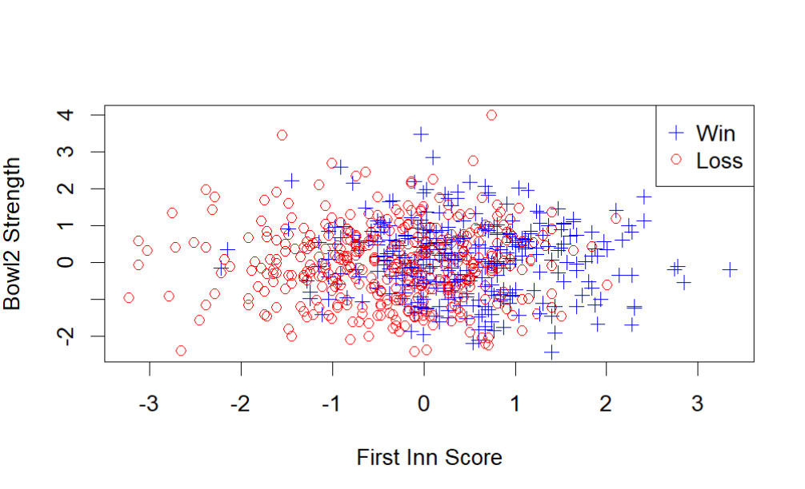
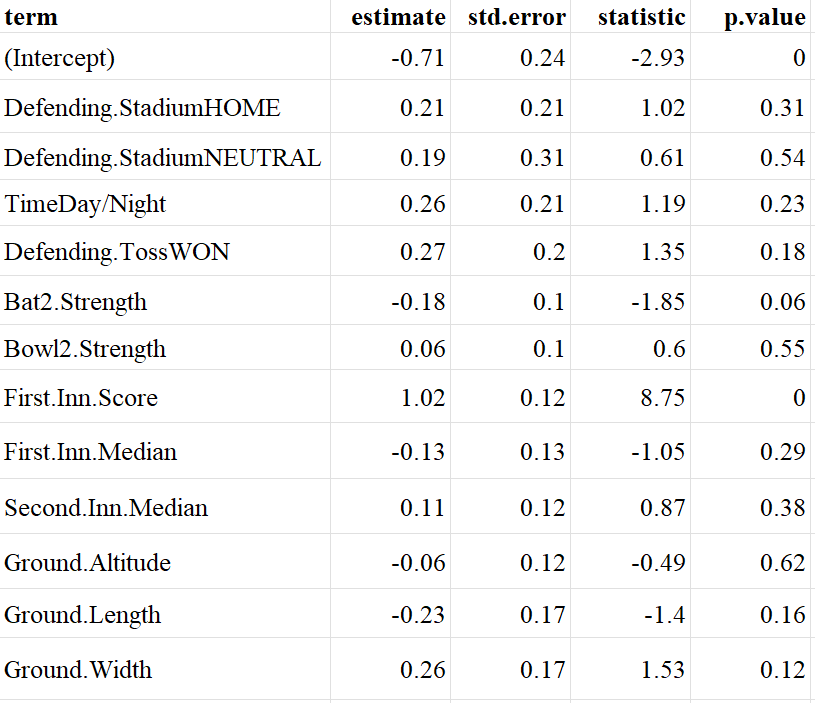
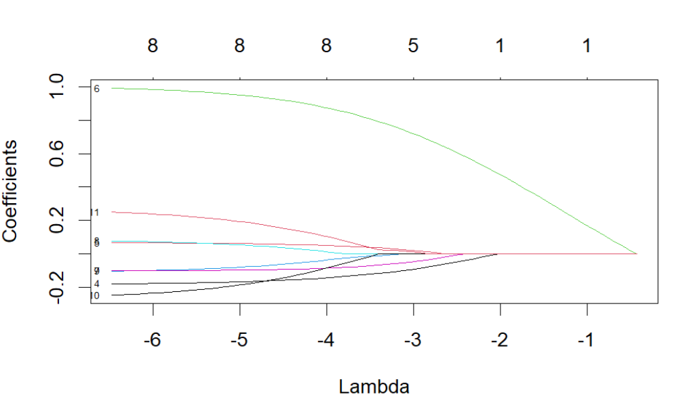
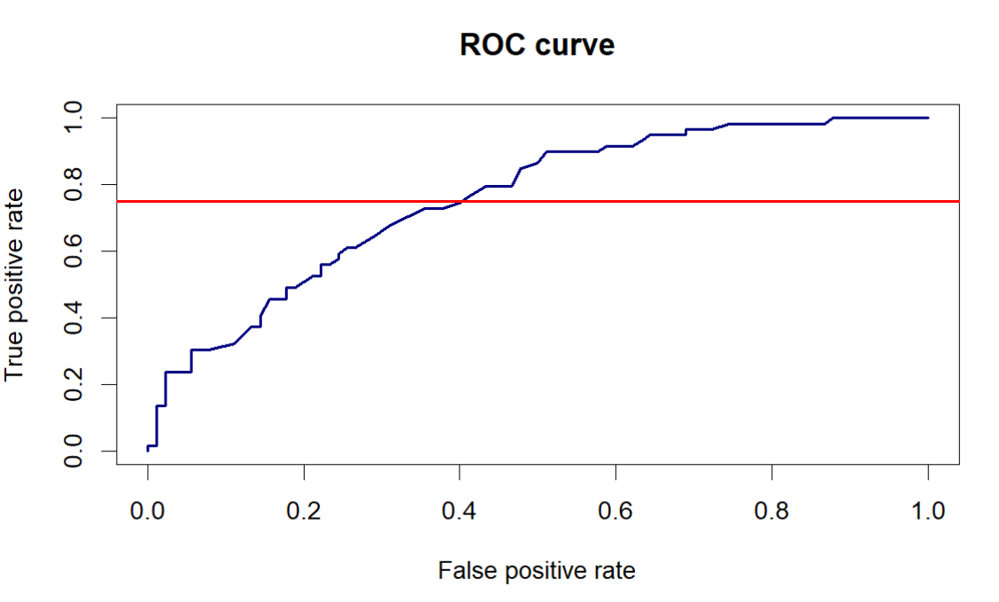
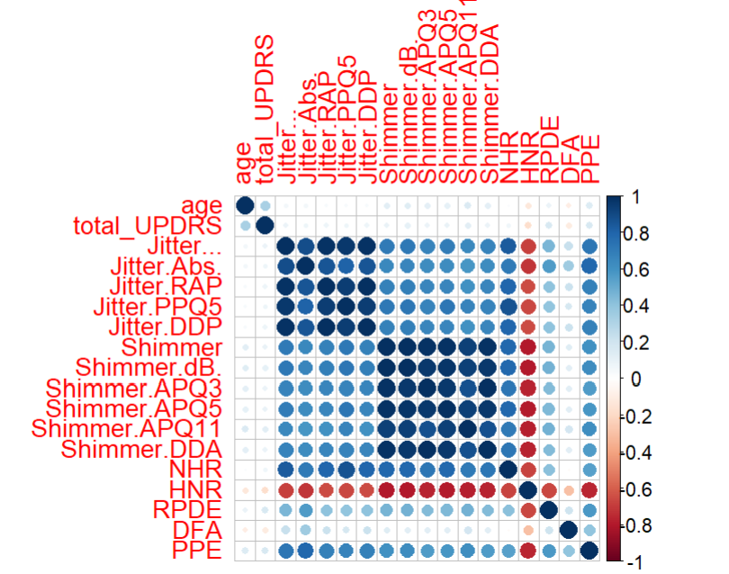
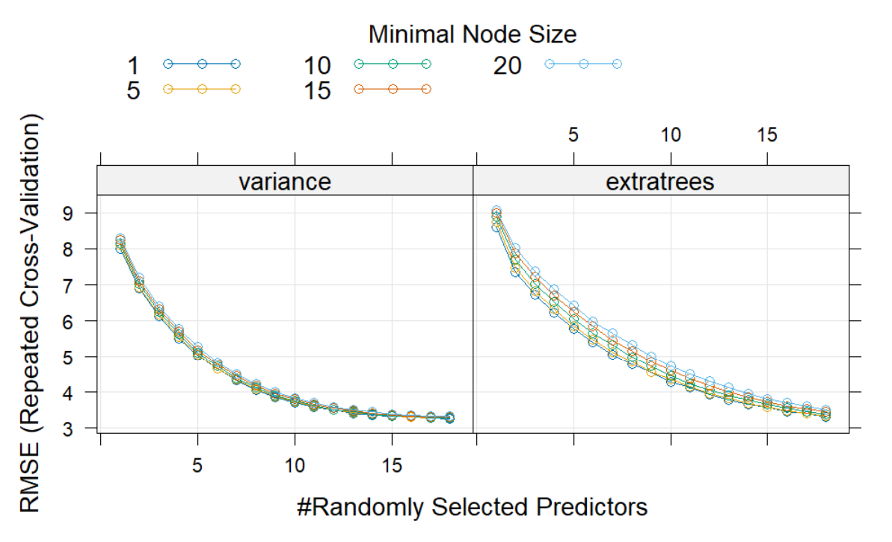
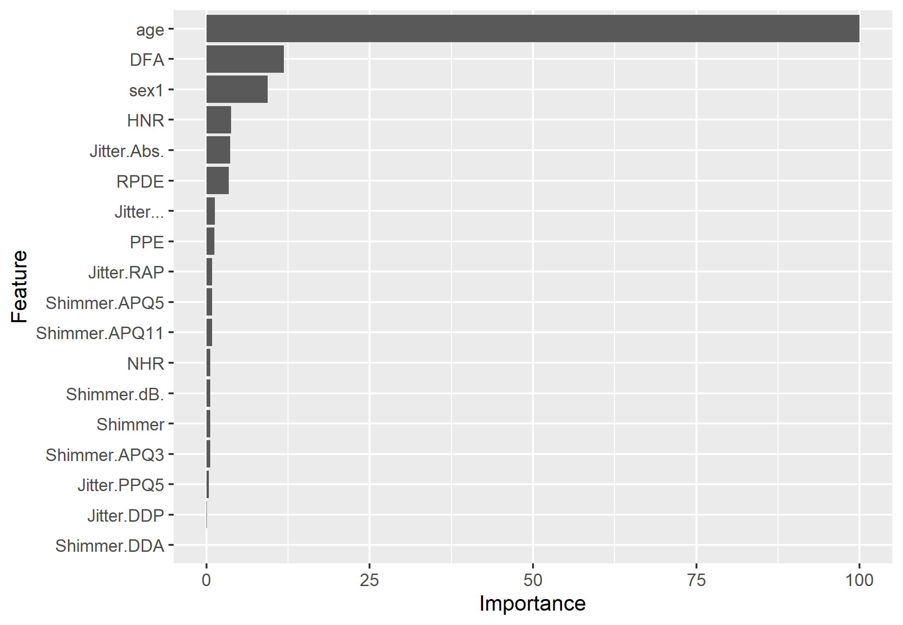

```{r setup, include=FALSE}
knitr::opts_chunk$set(echo = FALSE, eval = FALSE, warning = FALSE, message = FALSE)
```

# Question 1

```{r}
#Q1
#load data
mealies <- read.csv("Q1dat.csv")

str(mealies)

#convert data types 
mealies$pests <- as.factor(mealies$pests)
mealies$quality <- as.factor(mealies$quality)
nrow(mealies)
```

## Question 1a

After splitting the data into training and test sets using an 80/20 split, we fit a homogeneous tree by setting the minimum size of the terminal nodes to 2 and the minimum deviance to 0. This will achieve homogenous terminal nodes since the tree will always split for any deviance reduction and any node has at least 2 observations. We then plot the tree to see the structure.

This tree is grossly overfitted, and we see that location features and count result in the most classifications error reduction.

{width="433"}

We then test the perfomance with the 20% we splitted from the data. Below is the confusion matrix of the test showing a misclassification rate of 8%.

|          | A Predicted | B Predicted | C Predicted | D Predicted |
|----------|-------------|-------------|-------------|-------------|
| A Actual | 40          | 3           | 0           | 1           |
| B Actual | 2           | 70          | 1           | 0           |
| C Actual | 0           | 1           | 31          | 5           |
| D Actual | 4           | 0           | 3           | 89          |

```{r}
set.seed(1)
#split data into training and test 80/20 split
train_index <- sample(nrow(mealies), 0.8*nrow(mealies))

y_train <- mealies$quality[train_index]

library(tree)
#check ?text.tree to see the any infor of the nodes
#summary(tree_name_here) to see the tree details eg dev, 
#print the tree to see the tree info
mealies_big_tree <- tree(quality ~ . , data = mealies, subset = train_index, 
                  split = 'deviance',
                  control = tree.control(nobs=length(train_index), minsize = 2, mindev = 0))
plot.new
plot(mealies_big_tree)
text(mealies_big_tree, pretty = 0)

#Prediction accuracy
y_true  <-  mealies$quality[-train_index]
y_pred <- predict(mealies_big_tree, newdata = mealies[-train_index,], type = "class")

#misclassification rate
mean(y_true != y_pred)

#confusion matrix
table(y_pred, y_true)

```

## Question 1b

We use 10 fold cross validation and the misclassification error as the cost function. Figure 2 shows cross validation error against the number of terminal nodes and the penality alpha.

{width="415"}

We see the tree with the minimum cross validation error (red) line has over 20 nodes. But we choose the tree with 9 nodes (green line) because it has good interpretability at still relatively low error rate. Here we sacrifice a lower cross validation error for interpretability. The pruned tree has a test misclassification rate of 13.2% and the confusion matrix is shown below.

Comparing the test misclassification rate with the one from a), this tree performs worse than from an overfitted tree. We however gain interpretability at the cost of a sightly higher missclassification rate and perhaps best out of sample predictions.

The cross validation error of the chosen tree is higher than the test misclassification rate. This is a good sign that the tree is not overfitted. This discrepency can be explained by the high variability in the cross validations caused by the size of the data set.

|          | A Predicted | B Predicted | C Predicted | D Predicted |
|----------|-------------|-------------|-------------|-------------|
| A Actual | 30          | 10          | 1           | 4           |
| B Actual | 1           | 71          | 1           | 0           |
| C Actual | 0           | 3           | 22          | 12          |
| D Actual | 0           | 2           | 0           | 94          |

```{r}
#Q1b
set.seed(0)
mealies_cv <- cv.tree(mealies_big_tree, 
                      FUN = prune.misclass,
                      K = 10) #K is the number of folds

mealies_cv
plot.new
plot(mealies_cv
     $size, mealies_cv$dev, type = 'o',
     pch = 16, col = 'navy', lwd = 2,
     xlab = "Num of terminal nodes", ylab = "CV error")

#remove -inf for 0 penality
mealies_cv$k[1] <- 0
alpha <- round(mealies_cv$k, 1) #the penality 
axis(3, at = mealies_cv$size, lab = alpha, cex.axis = 0.8)
mtext(expression(alpha), 3, line = 2.5, cex = 1.2)

min_cv_error_tree_size <- mealies_cv$size[which.min(mealies_cv$dev)]
abline(v = min_cv_error_tree_size, lty = 2, col = 'red')

chosen_cv_error_tree_size <- mealies_cv$size[which(mealies_cv$k == 9)]
abline(v = chosen_cv_error_tree_size, lty = 2, col = 'green')


#prune the tree
pruned_mealies_tree <- prune.misclass(mealies_big_tree, best = chosen_cv_error_tree_size)


plot.new
plot(pruned_mealies_tree)
text(pruned_mealies_tree, pretty = 0)


#Prediction accuracy
y_true  <-  mealies$quality[-train_index]
y_pred <- predict(pruned_mealies_tree, newdata = mealies[-train_index,], type = "class")

#misclassification rate
mean(y_true != y_pred)

#confusion matrix
table(y_pred, y_true)

```

## Question 1c

We plot the location of the mealies on a scatter plot with the quality of the mealies represented by the color of the points. Tree methods partion the feature space othogonally and therefore we rotate the feature space to see if we can get a better partitioning of the feature space.

{width="465"}

```{r}
#Q1c
library(maps)
library(RColorBrewer)

plot.new
plot(mealies$latitude, mealies$longitude,
     pch = 16, cex = 0.5, bty = 'L',
     xlab = 'Lattitude', ylab = 'Longitude', col = mealies$quality)

legend('topright', legend = levels(mealies$quality), pch = 16, col = 1:4)


```

Now we apply 10 fold cross validation to the rotated data. We then plot the misclassification error against the rotation angle. We see that the misclassification error is lowest at 0.974 radians.

{width="424"}

The misclassification rate is 0.4%. This is expected because the tree method partions the feature space orthogonally and therefore rotating the feature space will find lower misclassification rates.

Below is the confusion matrix for the rotated feature space. This tree perform very well even on unseen data.

|          | A Predicted | B Predicted | C Predicted | D Predicted |
|----------|-------------|-------------|-------------|-------------|
| A Actual | 44          | 0           | 0           | 0           |
| B Actual | 0           | 73          | 0           | 1           |
| C Actual | 0           | 0           | 37          | 0           |
| D Actual | 0           | 0           | 0           | 95          |

```{r}
#rotate location feature space over thetas
rotated_mealies <- mealies
theta <- seq(0, pi/2, by = pi/100)
misclass <- rep(-1, length(theta))
for (i in 1:length(theta)){

  rotated_mealies$latitude <- cos(theta[i]) * mealies$latitude - sin(theta[i]) *   mealies$longitude
  rotated_mealies$longitude <- sin(theta[i]) * mealies$latitude + cos(theta[i]) * mealies$longitude
  
  #apply 10 fold cross validation to the rotated data
  rotated_mealies_big_tree <- tree(quality ~ . , data = rotated_mealies, subset = train_index, 
                    split = 'deviance',
                    control = tree.control(nobs=length(train_index), minsize = 2, mindev = 0))
  
  #cross validation
  rotated_mealies_cv <- cv.tree(rotated_mealies_big_tree, 
                        FUN = prune.misclass,
                        K = 10) #K is the number of folds
 
  #remove -inf for 0 penality
  rotated_mealies_cv$k[1] <- 0
  alpha <- round(rotated_mealies_cv$k, 1) #the penality 
  min_cv_error_tree_size <- rotated_mealies_cv$size[which.min(rotated_mealies_cv$dev)]
  pruned_rotated_mealies_tree <- prune.misclass(rotated_mealies_big_tree, best = 4)#set best = 4 and see misclass rates
  

  #Prediction accuracy
  y_true  <-  rotated_mealies$quality[-train_index]
  y_pred <- predict(pruned_rotated_mealies_tree, newdata = rotated_mealies[-train_index,], type = "class")
  
  #misclassification rate
  misclass[i] <- mean(y_true != y_pred)

}

#get the best theta
best_theta <- theta[which.min(misclass)]
best_theta
```

```{r}


#plot misclss rate against theta
plot.new
plot(theta, misclass, type = 'l', col = 'navy', lwd = 2,
     xlab = 'Theta', ylab = 'Misclassification rate')
```

```{r}
theta_i <- 0.9738937 #4 trees
rotated_mealies$latitude <- cos(theta_i) * mealies$latitude - sin(theta_i) *   mealies$longitude
  rotated_mealies$longitude <- sin(theta_i) * mealies$latitude + cos(theta_i) * mealies$longitude
  
#apply 10 fold cross validation to the rotated data
rotated_mealies_big_tree <- tree(quality ~ . , data = rotated_mealies, subset = train_index, 
                  split = 'deviance',
                  control = tree.control(nobs=length(train_index), minsize = 2, mindev = 0))

#cross validation
rotated_mealies_cv <- cv.tree(rotated_mealies_big_tree, 
                      FUN = prune.misclass,
                      K = 10) #K is the number of folds

#remove -inf for 0 penality
rotated_mealies_cv$k[1] <- 0
alpha <- round(rotated_mealies_cv$k, 1) #the penality 
min_cv_error_tree_size <- rotated_mealies_cv$size[which.min(rotated_mealies_cv$dev)]
pruned_rotated_mealies_tree <- prune.misclass(rotated_mealies_big_tree, best = min_cv_error_tree_size)#set best = 4 and see misclass rates


#Prediction accuracy
y_true  <-  rotated_mealies$quality[-train_index]
y_pred <- predict(pruned_rotated_mealies_tree, newdata = rotated_mealies[-train_index,], type = "class")

#misclassification rate
mean(y_true != y_pred)

#confusion matrix
table(y_true, y_pred)


```

# Question 2

We do some exploratory analysis to see the variables correlation. Below is the scatter plot of First Inn Score and Bowl2 Strength, this gives us a feel of the data we are modelling.

We remove the match id from the regression, standardize the data and use dummy variables for the categorical variables.

We also remove defending team and chasing team from the regression. As they are not consistent across seasons thus not useful for predictions.

{width="445"}

```{r}
library(dplyr)
#Qtn 2
#a
#remove match id from the regression,
#statndadize data in the regression
#use dummy variables for the categorical variables

ipl <- read.csv("Q2dat.csv",
                    colClasses = c(Defending.Result = 'factor',
                                   Time = 'factor',
                                   Defending.Toss = 'factor',
                                   Defending.Team = 'factor',
                                   Chasing.Team = 'factor',
                                   Defending.Stadium = 'factor'))

str(ipl)

#remove match id
ipl <- ipl[, -1]

#we remove defending team and chasing team from the regression
ipl <- select(ipl, -Defending.Team, -Chasing.Team)


set.seed(0)
train_index <- sample(nrow(ipl), size = 0.8*nrow(ipl))

```

```{r}
plot(ipl$First.Inn.Score, ipl$Bowl2.Strength,
     col = ifelse(ipl$Defending.Result == 1, 'blue', 'red'),
     pch = ifelse(ipl$Defending.Result == 1, 3, 1),
     xlab = 'First Inn Score', ylab = 'Bowl2 Strength')

legend('topright', c('Win', 'Loss'),
       col = c('blue', 'red'),
       pch = c(3, 1))


```

## Question 2a

After some feature selection we fit a vanilla model to get a feel of the model performance. We see that only First Inn score is significant.

{width="411"}

```{r}
library(kableExtra)
library(broom)

#standardize the data
ipl$Bat2.Strength <- scale(ipl$Bat2.Strength)
ipl$Bowl2.Strength <- scale(ipl$Bowl2.Strength)
ipl$First.Inn.Score <- scale(ipl$First.Inn.Score)
ipl$First.Inn.Median <- scale(ipl$First.Inn.Median)
ipl$Second.Inn.Median <- scale(ipl$Second.Inn.Median)
ipl$Ground.Altitude <- scale(ipl$Ground.Altitude)
ipl$Ground.Length <- scale(ipl$Ground.Length)
ipl$Ground.Width <- scale(ipl$Ground.Width)


#checking the prevalance rate
y_train <- ipl$Defending.Result[train_index]
mean(as.numeric(y_train) - 1)

#convert to data frame
ipl <- as.data.frame(ipl)

#fitting logistic regression
ipl_lr <- glm(Defending.Result ~ ., data = ipl, subset = train_index, family = 'binomial')

ipl_lr |> tidy() |> kable(digits = 2, caption = 'Logistic regression model fitted to IPL data')

```

We then fit an elastic net model to the data. We use cross validation to select the best alpha and lambda. We sequence alpha from 0 to 1 and use 10 fold cross validation to select the best lambda for each alpha.

The plot below shows the misclassificatioin rates for each alpha. The alpha yielding the least misclassification error is 0.3


```{r}

library(glmnet)
library(plotmo)
library(dplyr)

x_train <- select(ipl, -Defending.Result) |> slice(train_index)
x_train <- as.matrix(x_train)
y_train <- ipl$Defending.Result[train_index]


#range over which alpha is to be used
alpha_seq <- seq(0, 1, by = 0.1)
alpha_plot <- rep(0, length(alpha_seq))
for (i in 1:length(alpha_seq)){
ipl_en_cv <- cv.glmnet(x_train, y_train, family = 'binomial', alpha = alpha_seq[i], standardize = TRUE, type.measure = 'class')
#get the misclassification rate of the lambda.1se
alpha_plot[i] <- ipl_en_cv$cvm[which(ipl_en_cv$lambda == ipl_en_cv$lambda.1se)]
}
#print the lambda.1se
# coef(ipl_en_cv, s = ipl_en_cv\$lambda.1se)

plot(alpha_seq, alpha_plot, type = 'l', col = 'navy', lwd = 2,
xlab = 'Alpha', ylab = 'Misclassification rate')

#alpha 0.3 is the best
```

We fit the elastic net model with alpha = 0.3 and plot the coefficients. The best lambda is 0.28, as shown in figure 6.

We see that at these hyperparameter we only have 1 feature in the model.



First Inn Score with a coefficient of 0.25. This means that a unit increase in the first innings score increases the log odds of winning by 0.25.

```{r}


#fitting the elastic net with alpha = 0.3
ipl_en <- glmnet(x_train, y_train, family = 'binomial', alpha = 0.3, standardize = TRUE)
#plot the coefficients
plot(ipl_en, xvar = 'lambda', label = TRUE, xlab = 'Lambda', ylab = 'Coefficients')

ipl_en_cv <- cv.glmnet(x_train, y_train, family = 'binomial', alpha = 0.3
                       , standardize = TRUE, type.measure = 'class')
plot(ipl_en_cv)
#lambda.1se
ipl_en_cv$lambda.1se

coef(ipl_en_cv, s = ipl_en_cv$lambda.1se)


```

Below is the confusion matrix from testing the model.

|             | Loss Predicted | Win Predicted |
|-------------|----------------|---------------|
| Loss Actual | 80             | 10            |
| Win Actual  | 40             | 19            |

: Confusion Matrix

The F score is 0.43 showing that the model is not good because the score is less than 0.5.

```{r}
#F1 score testing accuracy
x_test <- select(ipl, -Defending.Result) |> slice(-train_index)
x_test <- as.matrix(x_test)
y_test <- ipl$Defending.Result[-train_index]

#predict the test data
y_pred <- predict(ipl_en_cv, newx = x_test, s = ipl_en_cv$lambda.1se, type = 'class')
#confusion matrix
confusion_matrix <- table(y_test, y_pred)
confusion_matrix

#F1 score
F1_score <- 2 * (confusion_matrix[2, 2]) / (2 * (confusion_matrix[2, 2]) + confusion_matrix[1, 2] + confusion_matrix[2, 1])
F1_score

#the test accuracy is 0.43 showing that the model is not good because the F1 score is less than 0.5

```


# Question 2b

The are under the ROC curve is 0.65. The ROC curve is shown below. The red line shows the recall of 0.75. At tau greater or equal to the red line, we have a recall value of at least 0.75.

{width="517"}

```{r}

#qtn 2b
library(ROCR)


#get the probabilities of the test data
y_prob <- predict(ipl_en_cv, newx = x_test, s = ipl_en_cv$lambda.1se, type = 'response')

#plot the ROC curve
pred <- prediction(y_prob, y_test)
perf <- performance(pred, 'tpr', 'fpr')
plot(perf, col = 'navy', lwd = 2, main = 'ROC curve')

#AUC
auc <- performance(pred, 'auc')


#add point with recall = 0.75
abline(h = 0.75, col = 'red', lwd = 2)


```


# Question 3

## Question 3a

We do some exploratory analysis to see the variables correlation. We see that Shimmer variables are highly correlated with each other and so are Jitter variables.

{width="361"}

```{r}
#Qtn 3
library(corrplot)
library(kableExtra)
library(broom)
library(dplyr)
#load the data
parkinsons <- read.csv("Q3dat.csv",
                       colClasses = c(sex = 'factor'))

str(parkinsons)

#split the data
set.seed(0)
train_index <- sample(nrow(parkinsons), size = 0.8*nrow(parkinsons))


x_train_cor <- select(parkinsons, -sex,) |> slice(train_index)
corrplot(cor(x_train_cor))

#Set data for train and test
x_train <- select(parkinsons, -total_UPDRS,) |> slice(train_index)
x_test <- select(parkinsons, -total_UPDRS,) |> slice(-train_index)
x_train <- as.matrix(x_train)
x_test <- as.matrix(x_test)
y_train <- parkinsons$total_UPDRS[train_index]

```

### Question 3a i

We fit an elastic net with alpha = 1 for lasso regularization. Our final model ( lambda.1se) has test MSE of 95, and variables age, sex, DFA with high significance.

The plot shows lambda and MSE for the elastic net model.

{width="466"}

```{r}
library(glmnet)
#split the data
set.seed(0)
train_index <- sample(nrow(parkinsons), size = 0.8*nrow(parkinsons))

parkinsons_en_cv <- cv.glmnet(x_train, y_train, family = 'gaussian', alpha = 0.5
                       , standardize = TRUE, type.measure = 'mse')

plot.new
#plot the cross validation error
plot(parkinsons_en_cv)

#add the lambda.1se and lambda.min points to the plot 
abline(v = log(parkinsons_en_cv$lambda.1se), col = 'red', lwd = 2)
abline(v = log(parkinsons_en_cv$lambda.min), col = 'green', lwd = 2)

#show coefficients of the lambda.1se
coef(parkinsons_en_cv, s = parkinsons_en_cv$lambda.1se)

#show mean squared error of the lambda.1se
parkinsons_en_cv$cvm[which(parkinsons_en_cv$lambda == parkinsons_en_cv$lambda.1se)]

#predict the test data
y_pred <- predict(parkinsons_en_cv, newx = x_test, s = parkinsons_en_cv$lambda.1se, type = 'response')

#mean squared error
mean((y_pred - parkinsons$total_UPDRS[-train_index])^2)

```

### Question 3a ii

We range k from 1 to 15 and set up the control for model training using 10-fold cross-validation, repeated 10 times to provide a robust estimate of model performance.

The choose k = 4 because it has the lowest RMSE.

{width="468"}

```{r}
library(ggplot2)
library(caret)

#KNN
#fit the model using knnreg
knn_grid <- expand.grid(k = 1:15)
# knn_control <- trainControl(method = 'repeatedcv', number = 10, repeats = 10)
# knn_model <- train(total_UPDRS ~ age + sex + Jitter.Abs. + Shimmer.APQ3 + Shimmer.DDA + NHR + HNR + RPDE + DFA + PPE,
#                    data = parkinsons,
#                    subset = train_index,
#                    method = 'knn',
#                    trControl = knn_control,
#                    tuneGrid = knn_grid)
# 
# #save the model
# saveRDS(knn_model, 'knn_model.rds')
#load the model
knn_model <- readRDS('knn_model.rds')

#plot the model
rmse_knn <- ggplot(knn_model, main = 'RMSE vs k') +
  geom_point(aes(x = k, y = RMSE), col = 'navy') +
  geom_line(aes(x = k, y = RMSE), col = 'navy') 

rmse_knn
ggsave('rmse_knn.png', rmse_knn)

#k = 4 as shown by the plot
knn_model$bestTune

#mse of the best model
knn_model$results[which(knn_model$bestTune == knn_model$bestTune$k),]
#predict the test data using the best model
y_pred <- predict(knn_model, newdata = parkinsons[-train_index,])

#mean squared error
mean((y_pred - parkinsons$total_UPDRS[-train_index])^2)


```


### Question 3a iii

Now we train a random forest model using ranger and caret. Number of variables randomly sampled as candidates at each split in the decision tree is varied from 2 to 20, and the minimum node size is 1, 5, 10, 15, 20. We use 10-fold cross-validation, repeated 10 times to provide a robust estimate of model performance. The variable importance plot show the variables Age, DFA, HNR, Jitter.Abs and RPDE as the most important variables in that order. 

The est MSE of 8.75.

{width="598"}

```{r}
#use ranger and caret to fit the model
library(caret)
library(ranger)

rf_grid <- expand.grid(mtry = 2: ncol(parkinsons) - 1,
                       splitrule = c('variance', 'extratrees'),
                       min.node.size = c(1, 5, 10, 15, 20))
rf_control <- trainControl(method = 'repeatedcv', number = 10, repeats = 10)

start.time <- Sys.time()

# rf_model_grid_search <- train(total_UPDRS ~ .,
#                   data = parkinsons,
#                   subset = train_index,
#                   method = 'ranger',
#                   trControl = rf_control,
#                   tuneGrid = rf_grid,
#                   importance = 'impurity')

end.time <- Sys.time()

# Calculate the time taken for this single iteration
time.taken <- end.time - start.time
#the time taken for the model to run
print(time.taken)

#save the model
# saveRDS(rf_model_grid_search, 'rf_model_grid_search.rds')
#load the model
rf_model_grid_search <- readRDS('rf_model_grid_search.rds')

plot(rf_model_grid_search)

# Calculate variable importance
importance <- varImp(rf_model_grid_search, scale = TRUE)

# Plot variable importance
plot(importance)
#plot the model

#show the best model
rf_model_grid_search$bestTune

#mse of the best model
rf_model_grid_search$results[which(rf_model_grid_search$bestTune == rf_model_grid_search$bestTune$mtry),]
rf_model_grid_search$results[which(rf_model_grid_search$bestTune == rf_model_grid_search$bestTune$mtry),]

mse_train$RMSE

#predict the test data using the best model
y_pred <- predict(rf_model_grid_search, newdata = parkinsons[-train_index,])

#mean squared error
mean((y_pred - parkinsons$total_UPDRS[-train_index])^2)


```

```{r}

#predict the test data using the best model
# y_pred <- predict(rf_model_grid_search, newdata = parkinsons_test)
# 
# #save the predictions
# write.csv(y_pred, file = 'rf_MTSTIN007.csv')
```

### Question 3a iv

We now fit the model using the xgboost algorithm. We search for the best hyperparameters using a grid search set to 100 boosting rounds and 10-fold cross validation repeated 10 times. We then fit the model using the best hyperparameters and predict the test data.

Below is the variable importance plot for the xgboost model. We notice that after the 8th variable the importance is 0. The most important features are age, DFA and sex.

```{r}

#fit the model using xgbTree
xgb_grid <- expand.grid(nrounds = 100,  # Number of boosting rounds
                        max_depth = 1:10,  # Maximum tree depth
                        eta = c(0.01, 0.1, 0.3),      # Learning rate
                        gamma = 0,      # Minimum loss reduction required to make a further partition
                        colsample_bytree = 1,  # Subsample ratio of columns when constructing each tree
                        min_child_weight = 1,  # Minimum sum of instance weight needed in a child
                        subsample = 1)  # Subsample ratio of the training instances

xgb_control <- trainControl(method = 'repeatedcv', number = 10, repeats = 10)

start.time <- Sys.time()

# xgb_model <- train(total_UPDRS ~ .,
#                    data = parkinsons,
#                    subset = train_index,
#                    method = 'xgbTree',
#                    trControl = xgb_control,
#                    tuneGrid = xgb_grid)

end.time <- Sys.time()

# Calculate the time taken for this single iteration
time.taken <- end.time - start.time
#the time taken for the model to run
print(time.taken)

#save the model
# save(xgb_model, file = 'xgb_model.RData')

#load the model
load('xgb_model.RData')

varimpo_xgboost <- ggplot(varImp(xgb_model), as.table = TRUE)
#save the plot
ggsave('varimpo_xgboost.png', varimpo_xgboost)


xgb_model$results[which(xgb_model$bestTune == xgb_model$bestTune$nrounds),]

y_pred <- predict(xgb_model, newdata = parkinsons[-train_index,])
y_pred
parkinsons$total_UPDRS[-train_index]
mean((y_pred - parkinsons$total_UPDRS[-train_index])^2)


```

{width="391"}

## Question 3b

The table below shows the test MSE of the 4 different models. Random forests produces the least MSE but an R squared of 51% and the parameters at best tune seem to overfit the model. So we shall choose XGBoost as the best model and use it to test the data performance with Q3testing.csv.

| Model            | MSE   |
|------------------|-------|
| Elastic net (L1) | 95.59 |
| KNN              | 14.90 |
| Random forest    | 8.77  |
| XGBoost          | 9.00  |

Below is the plot showing the RMSE of the XGBoost model. The selected model has a depth of 8. There is a low RMSE however its weakness is lack of interpretability. For lesser tree depths, where we have good interpretability, the RMSE has not yet converged.

{width="419"}

```{r}


#plot the model
rmse_xgboost <- ggplot(xgb_model, method = 'xgbTree')
#save the plot
ggsave('rmse_xgboost.png', plot = rmse_xgboost)


```

## Question 3c

The predictions for Q3testing are in MTSTIN007.csv. We train the selected XGBoost model on all the data for capturing more information on Q3testing.

```{r}
##read the test data
# parkinsons_test <- read.csv('Q3testing.csv',
#                             colClasses = c(sex = 'factor'))
# 
# 
# #predict the test data using the best model
# y_pred <- predict(xgb_model, newdata = parkinsons_test)
# 
# #save the predictions
# write.csv(y_pred, file = 'MTSTIN007.csv')
```


