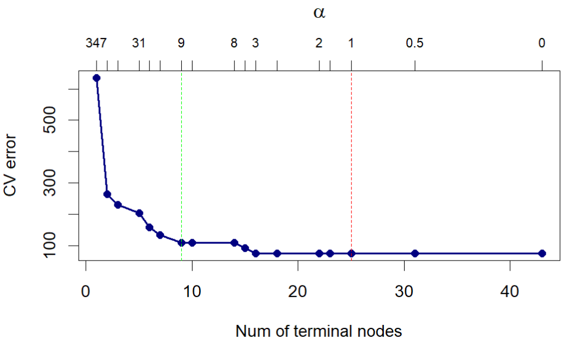

# Question 1

## Question 1a

After splitting the data into training and test sets using an 80/20 split, we fit a homogeneous tree by setting the minimum size of the terminal nodes to 2 and the minimum deviance to 0. This will achieve homogenous terminal nodes since the tree will always split for any deviance reduction and any node has at least 2 observations. We then plot the tree to see the structure.

This tree is grossly overfitted, and we see that location features and count result in the most classifications error reduction.

{width="433"}

We then test the perfomance with the 20% we splitted from the data. Below is the confusion matrix of the test showing a misclassification rate of 8%.

|          | A Predicted | B Predicted | C Predicted | D Predicted |
|----------|-------------|-------------|-------------|-------------|
| A Actual | 40          | 3           | 0           | 1           |
| B Actual | 2           | 70          | 1           | 0           |
| C Actual | 0           | 1           | 31          | 5           |
| D Actual | 4           | 0           | 3           | 89          |

## Question 1b

We use 10 fold cross validation and the misclassification error as the cost function. Figure 2 shows cross validation error against the number of terminal nodes and the penality alpha.

{width="415"}

We see the tree with the minimum cross validation error (red) line has over 20 nodes. But we choose the tree with 9 nodes (green line) because it has good interpretability at still relatively low error rate. Here we sacrifice a lower cross validation error for interpretability. The pruned tree has a test misclassification rate of 13.2% and the confusion matrix is shown below.

Comparing the test misclassification rate with the one from a), this tree performs worse than from an overfitted tree. We however gain interpretability at the cost of a sightly higher missclassification rate and perhaps best out of sample predictions.

The cross validation error of the chosen tree is higher than the test misclassification rate. This is a good sign that the tree is not overfitted. This discrepency can be explained by the high variability in the cross validations caused by the size of the data set.

|          | A Predicted | B Predicted | C Predicted | D Predicted |
|----------|-------------|-------------|-------------|-------------|
| A Actual | 30          | 10          | 1           | 4           |
| B Actual | 1           | 71          | 1           | 0           |
| C Actual | 0           | 3           | 22          | 12          |
| D Actual | 0           | 2           | 0           | 94          |

## Question 1c

We plot the location of the mealies on a scatter plot with the quality of the mealies represented by the color of the points. Tree methods partion the feature space othogonally and therefore we rotate the feature space to see if we can get a better partitioning of the feature space.

{width="465"}

Now we apply 10 fold cross validation to the rotated data. We then plot the misclassification error against the rotation angle. We see that the misclassification error is lowest at 0.974 radians.

{width="424"}

The misclassification rate is 0.4%. This is expected because the tree method partions the feature space orthogonally and therefore rotating the feature space will find lower misclassification rates.

Below is the confusion matrix for the rotated feature space. This tree perform very well even on unseen data.

|          | A Predicted | B Predicted | C Predicted | D Predicted |
|----------|-------------|-------------|-------------|-------------|
| A Actual | 44          | 0           | 0           | 0           |
| B Actual | 0           | 73          | 0           | 1           |
| C Actual | 0           | 0           | 37          | 0           |
| D Actual | 0           | 0           | 0           | 95          |

# Question 2

We do some exploratory analysis to see the variables correlation. Below is the scatter plot of First Inn Score and Bowl2 Strength, this gives us a feel of the data we are modelling.

We remove the match id from the regression, standardize the data and use dummy variables for the categorical variables.

We also remove defending team and chasing team from the regression. As they are not consistent across seasons thus not useful for predictions.

{width="445"}

## Question 2a

After some feature selection we fit a vanilla model to get a feel of the model performance. We see that only First Inn score is significant.

{width="411"}

We then fit an elastic net model to the data. We use cross validation to select the best alpha and lambda. We sequence alpha from 0 to 1 and use 10 fold cross validation to select the best lambda for each alpha.

The plot below shows the misclassificatioin rates for each alpha. The alpha yielding the least misclassification error is 0.3

We fit the elastic net model with alpha = 0.3 and plot the coefficients. The best lambda is 0.28, as shown in figure 6.

We see that at these hyperparameter we only have 1 feature in the model.

First Inn Score with a coefficient of 0.25. This means that a unit increase in the first innings score increases the log odds of winning by 0.25.

Below is the confusion matrix from testing the model.

|             | Loss Predicted | Win Predicted |
|-------------|----------------|---------------|
| Loss Actual | 80             | 10            |
| Win Actual  | 40             | 19            |

: Confusion Matrix

The F score is 0.43 showing that the model is not good because the score is less than 0.5.

# Question 2b

The are under the ROC curve is 0.65. The ROC curve is shown below. The red line shows the recall of 0.75. At tau greater or equal to the red line, we have a recall value of at least 0.75.

{width="517"}

# Question 3

## Question 3a

We do some exploratory analysis to see the variables correlation. We see that Shimmer variables are highly correlated with each other and so are Jitter variables.

{width="361"}

### Question 3a i

We fit an elastic net with alpha = 1 for lasso regularization. Our final model ( lambda.1se) has test MSE of 95, and variables age, sex, DFA with high significance.

The plot shows lambda and MSE for the elastic net model.

{width="466"}

### Question 3a ii

We range k from 1 to 15 and set up the control for model training using 10-fold cross-validation, repeated 10 times to provide a robust estimate of model performance.

The choose k = 4 because it has the lowest RMSE.

{width="468"}

### Question 3a iii

Now we train a random forest model using ranger and caret. Number of variables randomly sampled as candidates at each split in the decision tree is varied from 2 to 20, and the minimum node size is 1, 5, 10, 15, 20. We use 10-fold cross-validation, repeated 10 times to provide a robust estimate of model performance. The variable importance plot show the variables Age, DFA, HNR, Jitter.Abs and RPDE as the most important variables in that order. 

The est MSE of 8.75.

{width="598"}

### Question 3a iv

We now fit the model using the xgboost algorithm. We search for the best hyperparameters using a grid search set to 100 boosting rounds and 10-fold cross validation repeated 10 times. We then fit the model using the best hyperparameters and predict the test data.

Below is the variable importance plot for the xgboost model. We notice that after the 8th variable the importance is 0. The most important features are age, DFA and sex.

{width="391"}

## Question 3b

The table below shows the test MSE of the 4 different models. Random forests produces the least MSE but an R squared of 51% and the parameters at best tune seem to overfit the model. So we shall choose XGBoost as the best model and use it to test the data performance with Q3testing.csv.

| Model            | MSE   |
|------------------|-------|
| Elastic net (L1) | 95.59 |
| KNN              | 14.90 |
| Random forest    | 8.77  |
| XGBoost          | 9.00  |

Below is the plot showing the RMSE of the XGBoost model. The selected model has a depth of 8. There is a low RMSE however its weakness is lack of interpretability. For lesser tree depths, where we have good interpretability, the RMSE has not yet converged.

{width="419"}

## Question 3c

The predictions for Q3testing are in MTSTIN007.csv. We train the selected XGBoost model on all the data for capturing more information on Q3testing.

