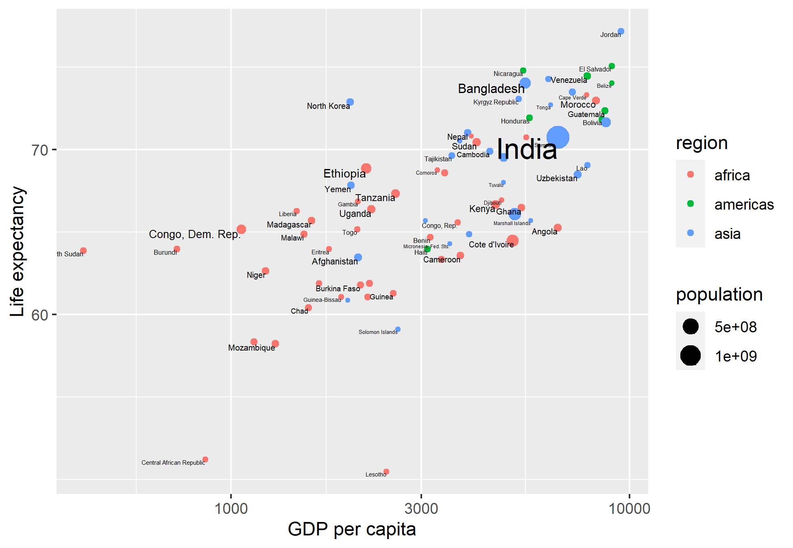
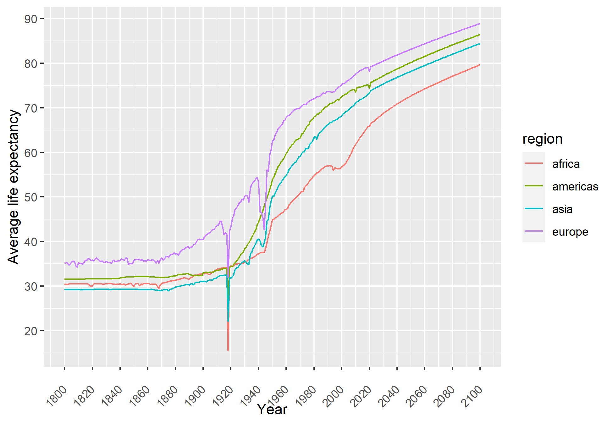
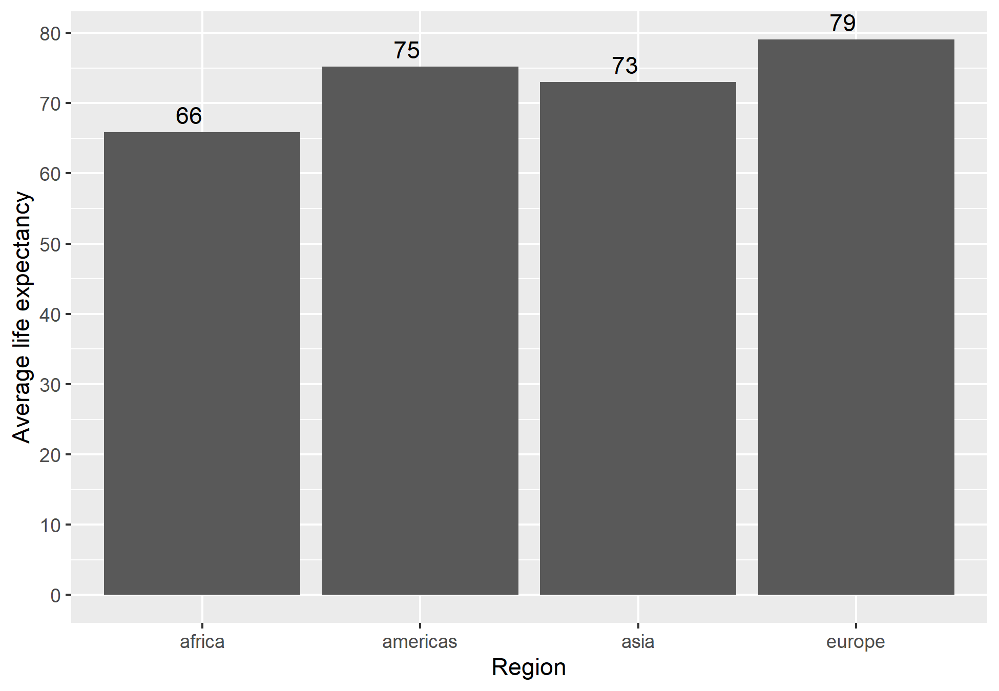

```{r setup, include=FALSE}
knitr::opts_chunk$set(echo = TRUE, warning = FALSE, message = FALSE)
```

```{r echo= FALSE}
library(dplyr)
library(ggplot2)
library(xlsx)
library(reshape2)
library(knitr)
```

## Question 1

First we read in the 4 datasets. The datasets are:

-   lex.csv

-   gdp_pcap.csv

-   Data Geographies - v2 - by Gapminder.xlsx

-   GM-Population - Dataset - v6.xlsx

Below is the code.

```{r}
#read data
lex_raw <- read.csv("lex.csv")
gdp_pcap_raw <- read.csv("gdp_pcap.csv")
region_raw <- read.xlsx("Data Geographies - v2 - by Gapminder.xlsx", sheetIndex = 2)
population_raw <- read.xlsx("GM-Population - Dataset - v6.xlsx", sheetIndex = 4)
```

### Question 1a

Now we will clean data and select the 2019 columns. Before we plot the data, we will merge the datasets and clean the dataframes. Using full join to get all the data from the columns. This creates tidy data for ggplot.

We will plot the life expectancy vs GDP per capita for each country in 2019. The size of the points will be determined by the population of the country. The colour of the points will be determined by the region of the country.

{width="11.8cm"}

Below is the code for the detailed procedure to generate figure 1.

```{r}
#data cleaning and selecting required data
lex_2019 <- select(lex_raw, country, X2019)

gdp_pcap_2019 <- select(gdp_pcap_raw, country, X2019)

#region data
#rename region col names
lookup <- c(country = "name",
            region = "four_regions")
region <- select(region_raw, name, four_regions) |> rename(all_of(lookup))


#population data
#deselect col
population_raw2 <- select(population_raw, -geo)
#rename cols
lookup <- c(country = "name",
            year = "time",
            population = "Population")

population_raw2 <- rename(population_raw2, all_of(lookup))

#select 2019 population
population_2019 <- filter(population_raw2, year == 2019)
```

```{r}
#merge and clean data frames
lex_gdp_2019 <- full_join(lex_2019, gdp_pcap_2019, by = join_by(country))
lex_gdp_region_2019 <- full_join(lex_gdp_2019, region, by = join_by(country))

#rename cols of new df
lookup <- c(lex = "X2019.x", 
            gdp_pcap = "X2019.y")
lex_gdp_region_2019 <- rename(lex_gdp_region_2019, all_of(lookup))

#make gdp_pcap numeric
lex_gdp_region_2019$gdp_pcap <- as.numeric(lex_gdp_region_2019$gdp_pcap)

lex_gdp_region_popu_2019 <- full_join(lex_gdp_region_2019, population_2019, by = join_by(country))
 
```

```{r}
plot_lex_gdp_region_popu_2019 <- na.omit(lex_gdp_region_popu_2019)
#scatter plot with ggplot
plot_lex_gdp_region_popu_2019 <- ggplot(data = plot_lex_gdp_region_popu_2019, mapping = aes(x = gdp_pcap, y = lex,
             colour = region,
             size = population,
             )) +
  geom_point() +
  geom_text(aes(label = country), check_overlap = TRUE, vjust = 1, hjust = 1, col = "black") +
  scale_x_log10() +
  scale_y_log10() +
  labs(
       x = "GDP per capita",
       y = "Life expectancy")
  

  # title = "GDP per capita vs Life expectancy 2019",
#save plot
ggsave("lex_gdp_region_popu_2019.png", plot = plot_lex_gdp_region_popu_2019)
```

### Question 1b

We will now calculate the average life expectancy for each region and the number of countries in each region.

| Region   | Ave Life Exp | Num of Countries |
|----------|--------------|------------------|
| Europe   | 79.1         | 49               |
| Americas | 75.2         | 35               |
| Asia     | 73.0         | 59               |
| Africa   | 65.9         | 54               |

: Table of average life expectancy and the number of countries in each region.

The code below generated the Table 1.

```{r}
#Qtn b
region_avg_lex <- lex_gdp_region_popu_2019 |> group_by(region) |> summarise(avg_region_lex = mean(lex, na.rm = TRUE), countries_in_region = n())

#remove na region
region_avg_lex <- na.omit(region_avg_lex)

#sort by avg_region_lex descending
region_avg_lex <- region_avg_lex |> arrange(desc(avg_region_lex))
# region_avg_lex

```

### Question 1c

We will now calculate the average life expectancy for each region and year. We will then plot the average life expectancy for each region over time.

{width="11.6cm"}

The code below generated Figure 2.

```{r}
#Qtn c

#melt lex_raw
lex_melt <- melt(lex_raw, id.vars = "country", value.name = "lex", variable.name = "year")


#merge lex_melt with regions
lex_region <- full_join(lex_melt, region, by = "country")

region_avg_lex <- lex_region |> group_by(region, year) |> summarise(avg_lex = mean(lex, na.rm = TRUE))

#remove leading X from year
region_avg_lex$year <- gsub("X", "", region_avg_lex$year)
#make year numeric
region_avg_lex$year <- as.numeric(region_avg_lex$year)
```

```{r}
plot_region_avg_lex = na.omit(region_avg_lex)
plot_region_avg_lex <- ggplot(data = plot_region_avg_lex, mapping = aes(x = year, y = avg_lex, group = region, col = region)) +
  geom_line() +
  labs(
       x = "Year",
       y = "Average life expectancy") +
  scale_x_continuous(breaks = seq(1800, 2160,20)) +
  scale_y_continuous(breaks = seq(0, 90, 10)) +
  theme(axis.text.x = element_text(angle = 45, vjust = 0.5, hjust = 1))
  
# title = "Region average life expectancy over time",

#save plot
ggsave("region_avg_lex.png", plot = plot_region_avg_lex)
```

### Question 1d

We will now plot the average life expectancy for each region in 2019. We will use a bar chart to plot the data.

{width="387"}

```{r}
#Qtn d
#select 2019 data
region_avg_lex_2019 <- filter(region_avg_lex, year == 2019)
#drop na region
region_avg_lex_2019 <- na.omit(region_avg_lex_2019)

#plot bar chart
region_avg_lex_2019 <- ggplot(data = region_avg_lex_2019, mapping = aes(x = region, y = avg_lex)) +
  geom_bar(stat = "identity") +
  labs(
       x = "Region",
       y = "Average life expectancy") +
  # theme(axis.text.x = element_text(angle = 45, vjust = 0.5, hjust = 1)) +
  scale_y_continuous(breaks = seq(0, 90, 10)) +
  geom_text(aes(label = round(avg_lex, 0)), vjust = -0.5, hjust = 1, col = "black")

# title = "Region average life expectancy 2019",

#save plot
ggsave("region_avg_lex_2019.png", plot = region_avg_lex_2019)

```

### Question 1e

We will now calculate the number of countries that have a two-word name. The number of countries that have a two-word name is 24

The code below uses strsplit and sapply to calculate the number of countries that have a two-word name.

```{r}
#Qtn e
country_split <- strsplit(lex_raw$country, " ")

#get count two word countries
two_word_countries <- sum(sapply(country_split, length) == 2)
# two_word_countries
```
