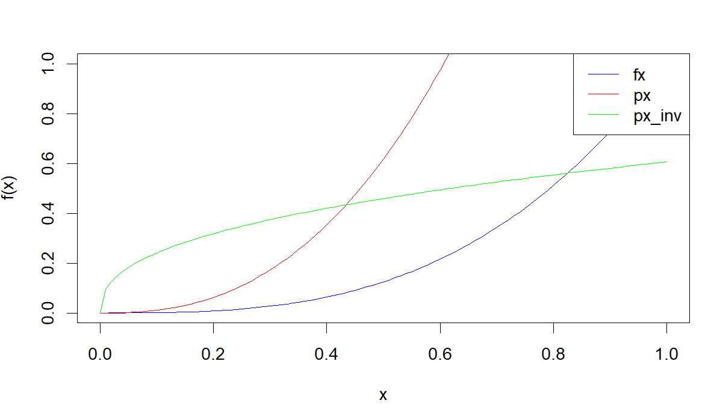
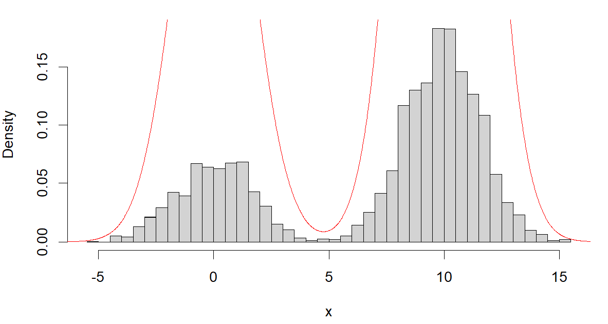
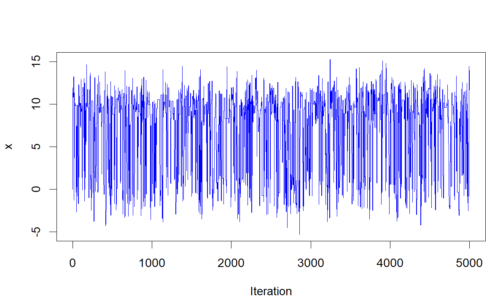
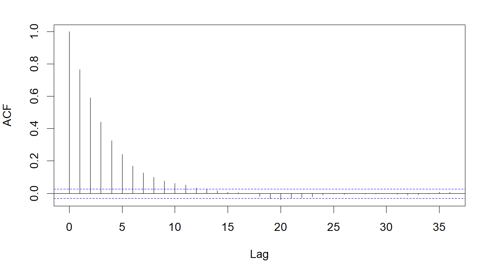

# Question 1

The true integral value is given by:

$$ \int_0^1x^3dx = [x^4/4]_0^1 = 0.25 $$


## Question 1a

Now we approximate the integral using uniform distribution. We define fx, sample 1000 uniform values between 0 and 1, and calculate the mean value of the function. The integral estimate is the area of the rectangle, mean value multiplied by the interval difference. We get an estimate of 0.246, with a standard error of 0.008893

```{r}
#fx function def
fx <- function(x, n){
  return(x**n)
}


N <- 1000
a <- 0
b <- 1


```

```{r}

#sample 1000 uniform values between 0 and 1
set.seed(123)
x_sample_unif <- runif(N, 0, 1)

y_sample <- fx(x = x_sample_unif, n = 3)

mean_sample <- sum(y_sample)/ N

intergral_est <- mean_sample * (b - a)
intergral_est

#standard error of the estimate
sqrt((sum((y_sample - mean_sample)**2))/(N * (N-1)))


```

```{r}
```

## Question 1b

For accept reject sampling, we use a power law distribution as a proposal distribution. We sample 1000 values from the proposal distribution, using the inverse transform sampling method. We then calculate the acceptance probability (ratio of target to proposal). We then sample from a uniform distribution and accept the sampled values that are less than the acceptance probability. The estimate of the integral is the mean of the accepted values. We get an estimate of 0.115, with a standard error of 0.000199

```{r}
set.seed(123)
#proposal distribution a power law distribution
N <- 10000

px <- function(x, k){
  return((k+1) * x**k)
}


px_inv <- function(y, k){
  return((y/(k+1)) ** (1/k))
}

uniform_sample <- runif(N, 0, 1)

#inverse transform sampling
x_sample_ar <- px_inv(uniform_sample, k = 2.5)

#prob of acceptance
prob_accept <- fx(x_sample_ar, n = 3)/px(x_sample_ar, k = 2.5)

#sample from uniform distribution
u_sample <- runif(N, 0, 1)

#acceptance rejection
x_sample_ar <- x_sample_ar[u_sample < prob_accept]

#take first 1000 values
x_sample_ar <- x_sample_ar[1:1000]

#find the estimate
intergral_est <- sum(fx(x_sample_ar, n = 3))/length(x_sample_ar)

intergral_est

#standard error of the estimate
sqrt((sum((fx(x_sample_ar, n = 3) - intergral_est)**2))/(N * (N-1)))


```

## Question 1c

For importance sampling, we use the same proposal distribution as in b). We sample 1000 values from uniform distribution between 0 and 1, use inverse of the power law distribution to get the values of x. We then weight the sample values by the ratio of the target and proposal distribution. We get an estimate of 0.185, with a standard error of 0.000991

```{r}
#Importance sampling with the same proposal candidate distribution as px
set.seed(123)
N <- 1000

#sample 1000 from px
x_sample_imp <- px_inv(runif(N, 0, 1), k = 2.5)

#find the weights
weights <- fx(x_sample_imp, n = 3)/px(x_sample_imp, k = 2.5)

#find the estimate
intergral_est <- sum(weights)/N

intergral_est

#standard error of the estimate
sqrt((sum((weights - intergral_est)**2))/(N * (N-1)))

```

## Question 1 conclusions

The uniform sampling estimate is the closest to the true value of the integral as it samples from a true uniform (and the target is a CDF) compared to the inverse of px which is not truly uniform (shown in figure 1). Importance sampling performs better than just using the proposal distribution as it places more weight on the values of x that are closer to the target distribution.

{width="538"}

```{r, eval = FALSE}
#plot fx 
x <- seq(0, 1, 0.01)
y <- fx(x, n = 3)
plot(x, y, type = "l", col = "blue", xlab = "x", ylab = "f(x)")

# plot the proposal distribution
x <- seq(0, 1, 0.01)
y <- px(x, k)
lines(x, y, col = "red")

# plot the inverse of the proposal distribution
x <- seq(0, 1, 0.01)
y <- px_inv(x, k)
lines(x, y, col = "green")

legend("topright", legend = c("fx", "px", "px_inv"), col = c("blue", "red", "green"), lty = 1:1)

```

Uniform sampling has a high standard error as it covers the most rejection area of the target distribution (it is wasteful). Accept reject sampling has the lowest standard error as it samples from the proposal distribution and accepts only the values that are close to the target distribution. Importance sampling has a higher standard error than accept reject sampling as it samples from the proposal distribution and places more weight on the values of x that are closer to the target distribution.

# Question 2

First we define the target distribution and the proposal distribution. We then use the metropolis algorithm to sample values from the proposal distribution and accept or reject the values based on the ratio of the target and proposal distribution.

{width="536"}


The Markov chain (figure 3)looks like white noise showing that the samples are independent of each other.


The autocorrelation plot (figure 4) shows that the samples are independent of each other from the 14th lag onward.


```{r}
#metroplis algorithm

#target distribution
px <- function(x){
  return(0.3 * exp(-0.2 * x**2) + 0.7 * exp(-0.2 * (x - 10)**2))
}

#proposal distribution
sigma <- 10
q <- function(x, sigma){
  return(rnorm(1, x, sigma))
}

```

```{r}
#metropolis algorithm
set.seed(123)
N <- 5000
x <- rep(0, N)
x[1] <- 0
for (i in 2:N){
  x_star <- q(x[i-1], sigma)
  alpha <- min(1, px(x_star)/px(x[i-1]))
  u <- runif(1, 0, 1)
  if (u < alpha){
    x[i] <- x_star
  } else {
    x[i] <- x[i-1]
  }
}


```

```{r eval = FALSE}
#plot the histogram of the samples
hist(x, freq = F, breaks = 50, xlab = "x", ylab = "Density")


#superimpose the true distribution
x_tru <- seq(-10, 20, 0.01)
y_tru <- px(x_tru)

#min max normalization for the values to be between 0 and 1
y_tru <- (y_tru - min(y_tru))/(max(y_tru) - min(y_tru))

lines(x_tru, y_tru, col = "red")

```


{width="519"}

```{r eval = FALSE}
#plot the markov chain
plot(x, type = "l", col = "blue", xlab = "Iteration", ylab = "x")

```


{width="537"}

```{r eval = FALSE}
#plot the autocorrelation
acf(x)


```
